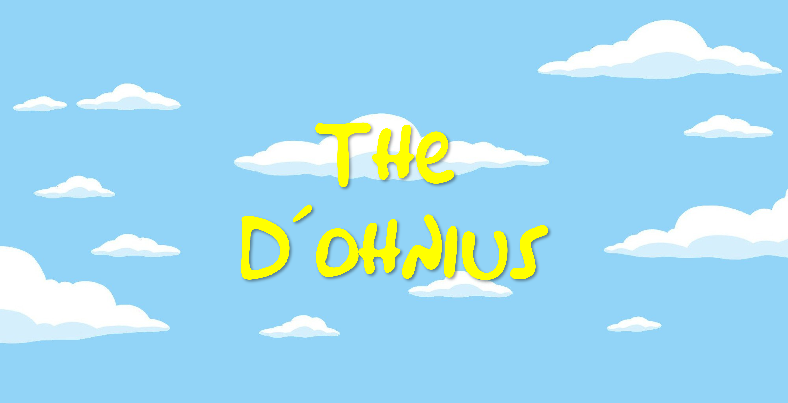

 
 

# Bem-vindo(a) ao The D'ohnius!

> Projeto desenvolvido durante o curso **Criando seu jogo de memória estilo Genius** da [Digital Innovation One.](https://digitalinnovation.one/)  
> O objetivo era desenvolver um jogo estilo **GENIUS**, Desafio cumprido com um toque especial

## 🛠 Ferramentas:

    
    
    

 
 

## 🎨 Autor:
Henrique de Castr
 
 

## ☑ Licença:
Projeto está sob licença do [MIT](https://opensource.org/licenses/mit-license.php)